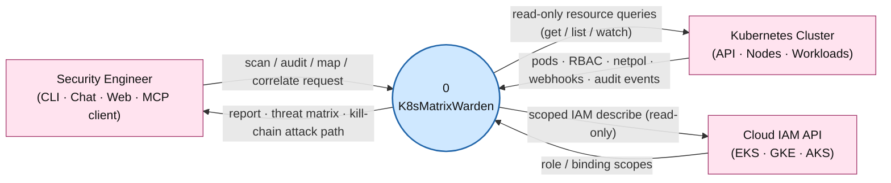
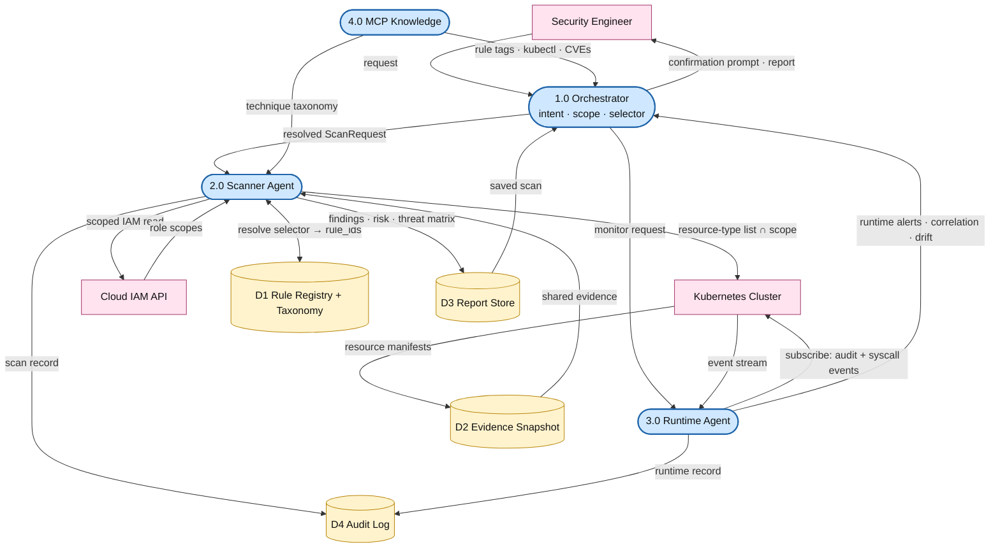
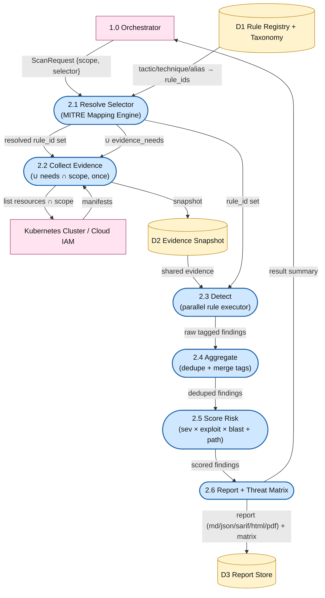
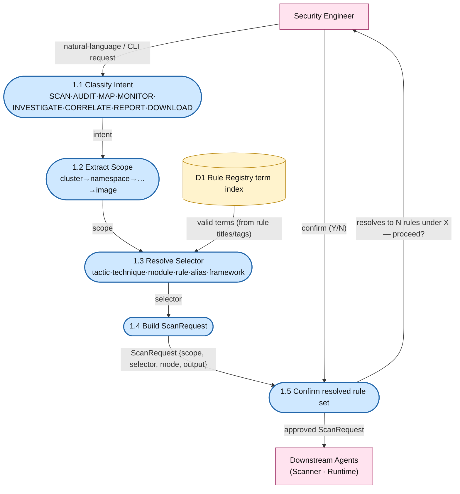
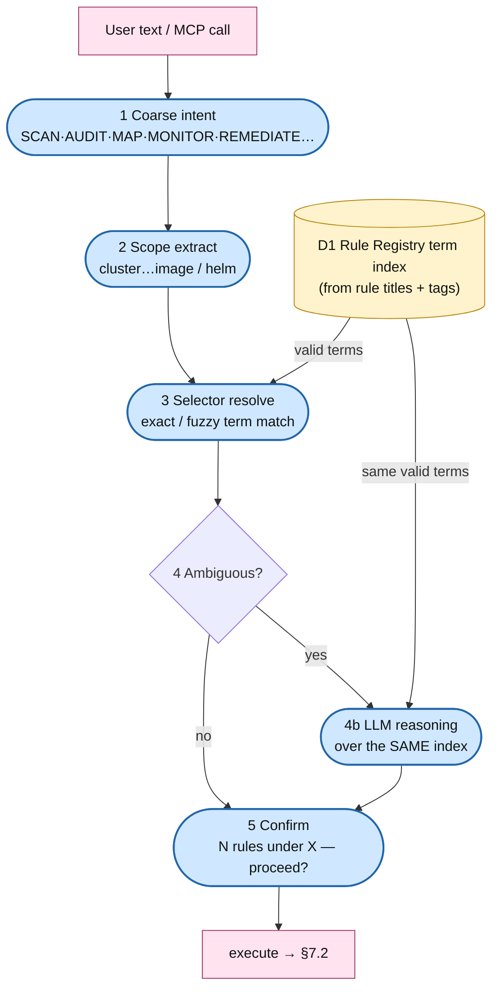

<p align="center">
  
</p>

<h1 align="center">K8sMatrixWarden</h1>

<p align="center">
  <strong>AI-Powered Kubernetes Security Platform</strong><br/>
  <em>MITRE ATT&CK-Aligned · Domain-Sharded Scanning · Runtime Correlation · Detect-and-Report</em>
</p>

<p align="center">
  
  
  
  
  
</p>

---

## Overview

> **K8sMatrixWarden v1.0** is a Kubernetes-native, MITRE ATT&CK-aligned security platform. Its macro-architecture is four collaborating components — **Orchestrator · Scanner · Runtime · MCP Server**. The Scanner Agent runs **Domain-Sharded Execution over a Cross-Cutting Rule / Technique Registry**: every check is a **Rule** tagged with the MITRE tactic and technique it detects, so a scan can be sliced by resource *or* by adversary behavior through one uniform engine. Every surface is **detect-and-report only** — read-only against the cluster, with no apply or mutate path.

| Pillar | What it means |
|---|---|
| **Scanner structure** | 10 **domain shards** (control plane, workload, RBAC, network, image, secrets, compliance, attack surface, admission control, cloud IAM), each a plugin owning a set of independent **Rules** |
| **Unit of detection** | **Rule** — one technique-level check with self-declared taxonomy tags |
| **MITRE mapping** | Declarative per-rule tags, indexed by a **MITRE Mapping Engine**, validated in CI against **ATT&CK for Containers** IDs |
| **Threat matrix** | The real **9 tactics** of the Kubernetes Threat Matrix, projected per scan |
| **Scan selection** | Scan by **scope** (cluster→pod→image) **× selector** (tactic · technique · module · rule · composite alias · framework) |
| **Execution** | Registry **resolves selector → rule_id set**, one shared evidence fetch, parallel rule execution |
| **Extensibility** | Register a **plugin**, tag a rule — additive, no engine change |
| **RBAC** | Per-plugin **scoped RoleBindings** minted from each shard's declared verbs |

---

## Table of Contents

<details>
<summary><strong>Click to expand full table of contents</strong></summary>

| # | Section | Description |
|---|---------|-------------|
| 1 | [Executive Summary](#1-executive-summary) | High-level overview and value proposition |
| 2 | [Problem Statement](#2-problem-statement) | Why this tool exists |
| 3 | [Architecture](#3-architecture) | Domain-sharded execution + cross-cutting rule registry |
| 4 | [Orchestrator Agent](#4-orchestrator-agent) | Intent, scope & selector resolution, safety controls |
| 5 | [Scanner Agent — Domain Shards & Rules](#5-scanner-agent--domain-shards--rules) | 10 shards, the Rule model, all checks |
| 6 | [Rule Registry & MITRE Mapping Engine](#6-rule-registry--mitre-mapping-engine) | The cross-cutting index that ties it together |
| 7 | [Scan Workflow & Selectors](#7-scan-workflow--selectors) | Scan by scope, tactic, technique, alias, framework |
| 8 | [Runtime Agent](#8-runtime-agent) | Real-time threat detection & monitoring |
| 10 | [K8s Security MCP Server](#10-k8s-security-mcp-server) | Knowledge layer — datasets, taxonomy & commands |
| 12 | [MITRE ATT&CK for Kubernetes](#12-mitre-attck-for-kubernetes) | Corrected 9-tactic threat matrix & mapping |
| 13 | [OWASP Kubernetes Top 10 (2025)](#13-owasp-kubernetes-top-10-2025) | Complete coverage with detection & guidance |
| 14 | [Kubernetes Goat — Vulnerability Scenarios](#14-kubernetes-goat--vulnerability-scenarios) | All 22 scenarios mapped |
| 15 | [Real-World CVEs & Attack Patterns](#15-real-world-cves--attack-patterns) | 15+ CVEs and 12 attack writeups |
| 16 | [Scanner Configuration Spec](#16-scanner-configuration-spec) | Registry-aware scan configuration |
| 17 | [End-to-End Workflows](#17-end-to-end-workflows) | Resource, tactic & technique scans |
| 18 | [Security Scoring & Reporting](#18-security-scoring--reporting) | Attack-path-aware scoring, tag-filterable reports |
| 19 | [Deployment Architecture](#19-deployment-architecture) | How the tool runs inside K8s |
| 20 | [RBAC Configuration](#20-rbac-configuration) | Least-privilege, per-plugin scoped roles |
| 22 | [Open-Source Tool Integrations](#22-open-source-tool-integrations) | Integrated as normalizing adapters |
| 25 | [Glossary](#25-glossary) | Key terms & acronyms |
| 26 | [References](#26-references) | Standards, frameworks, learning resources |

</details>

---

## 1. Executive Summary

### What

**K8sMatrixWarden** is an AI-powered, Kubernetes-native security platform that continuously scans and monitors Kubernetes clusters. It uses a **multi-agent architecture** where specialized agents collaborate to detect vulnerabilities, map attack surfaces, correlate static findings with live runtime behavior, and enforce compliance. It is **detect-and-report only** — read-only on every surface, so it never mutates the cluster.

The Scanner Agent is organized around the **MITRE ATT&CK threat model for Kubernetes**: every check is a **Rule** tagged with the tactic and technique it detects, so users can scan by resource *or* by adversary behavior ("scan for Persistence", "scan only Container Escape") through one uniform engine.

### Why

Kubernetes clusters are complex, dynamic, and present a broad attack surface. Misconfigurations are a leading cause of K8s breaches, and manual security reviews are difficult to scale. K8sMatrixWarden speaks the attacker's language — it connects every finding to how an adversary actually operates and, uniquely, correlates static configuration findings with live runtime behavior: **Detect → Analyze (map to ATT&CK) → Correlate (join to runtime + derive the kill-chain) → Report**.

### How

```
┌──────────────┐     ┌─────────────────┐     ┌────────────────┐     ┌──────────────┐
│              │     │                 │     │                │     │              │
│   DETECT     │────▶│    ANALYZE      │────▶│   CORRELATE    │────▶│   REPORT     │
│              │     │                 │     │                │     │              │
│  Rules run   │     │  Map to ATT&CK, │     │  Join findings │     │  Deep-linked │
│  by shard,   │     │  OWASP, CIS.    │     │  to live       │     │  findings +  │
│  resolved by │     │  Score risk +   │     │  runtime;derive│     │  Validation  │
│  tactic/tech │     │  attack-path.   │     │  the kill-chain│     │  steps, 7    │
│  or resource │     │  Prioritize.    │     │  attack path.  │     │  formats.    │
│              │     │                 │     │                │     │              │
└──────────────┘     └─────────────────┘     └────────────────┘     └──────────────┘
```

### Key Capabilities

| Capability | Description |
|---|---|
| **ATT&CK-Aligned Scanning** | Every finding is a Rule tagged with MITRE tactic + technique; scan by adversary behavior, not just by resource |
| **Attack Surface Mapping** | Enumerates every external entry point, container escape vector, privilege escalation path, and lateral movement route |
| **Domain-Sharded Deep Scanning** | 10 domain shards covering control plane, workloads, RBAC, network, images, secrets, compliance, attack surface, admission control, cloud IAM |
| **Cross-Cutting Rule Registry** | One registry indexes every rule by tactic, technique, OWASP, CIS & NSA tags — slice a scan any way |
| **Runtime Threat Detection** | Real-time syscall monitoring (Falco/Tetragon), behavioral baselines, drift detection, K8s audit analysis |
| **Scan × Runtime Correlation** | Joins static findings to live runtime events by MITRE tactic — *confirmed / corroborated / runtime-only* — and derives the kill-chain attack path |
| **Compliance Enforcement** | Continuous CIS Benchmark, Pod Security Standards, NSA/CISA hardening checks with drift alerting |
| **Detect-and-Report Only** | Read-only by design across every surface (CLI, MCP, web); scanning uses get/list/watch only, with no write or apply path anywhere |
| **Plugin Extensibility** | New scanners, techniques, frameworks and enterprise rules added additively via the plugin + tag model |

---

## 2. Problem Statement

### The Kubernetes Security Challenge

```
┌─────────────────────────────────────────────────────────────────────────┐
│                                                                         │
│   "67% of companies have delayed or slowed deployment of Kubernetes     │
│    due to security concerns"  — Red Hat State of K8s Security 2024      │
│                                                                         │
│   "Nearly 90% of containers run on Kubernetes, yet most organizations   │
│    lack visibility into K8s-specific threats"  — Sysdig 2024 Report     │
│                                                                         │
│   "Misconfigurations account for over 40% of K8s security incidents"    │
│    — NSA/CISA Kubernetes Hardening Guidance                             │
│                                                                         │
└─────────────────────────────────────────────────────────────────────────┘
```

---

## 3. Architecture

### 3.1 System Architecture

```
┌─────────────────────────────────────────────────────────────────────────────────┐
│   Security Engineer      ┌───────┐ ┌──────┐ ┌───────┐ ┌────────────┐              │
│                          │  CLI  │ │ Chat │ │ Web   │ │ MCP client │              │
│                          └───┬───┘ └──┬───┘ └───┬───┘ └─────┬──────┘              │
│                              └────────┼─────────┴───────────┘                     │
│                                       ▼                                           │
│   ┌────────────────────────────────────────────────────────────┐                 │
│   │                     ORCHESTRATOR AGENT                       │                 │
│   │   Intent Classifier · Scope Extraction · Selector Resolution │                 │
│   │   Response Aggregator · Risk Scorer · Confirmation Controller │                 │
│   └───────────────────┬───────────────────────┬────────────────┘                 │
│                       ▼                       ▼                                    │
│           ┌────────────────────┐   ┌────────────────────┐                         │
│           │   SCANNER AGENT     │   │   RUNTIME AGENT     │                         │
│           │                     │   │   (DaemonSet)       │                         │
│           │ Registry Layer:     │   │ Falco / Tetragon    │                         │
│           │ • Scanner Registry  │   │ Audit Analyzer      │                         │
│           │ • Rule Registry     │   │ Drift Detector      │                         │
│           │ • MITRE Mapping     │   │ Baseline Engine     │                         │
│           │ 10 Domain Shards    │   │ (same registry      │                         │
│           │ Execution Layer     │   │  pattern)           │                         │
│           └─────────┬──────────┘   └──────────┬─────────┘                         │
│                     └───────────────┬─────────┘                                   │
│                                     ▼                                             │
│   ┌──────────────────────────────────────────────────────────────────┐            │
│   │                    K8s SECURITY MCP SERVER                         │            │
│   │  kubectl cmds · scan-tool cmds · CVE KB · compliance rules ·       │            │
│   │  MITRE / OWASP / CIS taxonomy files                                │            │
│   └────────────────────────────────┬─────────────────────────────────┘            │
│                                    ▼  (read-only: get / list / watch)             │
│   ┌──────────────────────────────────────────────────────────────────┐            │
│   │                    TARGET KUBERNETES CLUSTER                       │            │
│   │  Control Plane · Worker Nodes · Pods/Workloads · Network/RBAC/     │            │
│   │  Secrets · Admission Webhooks · Cloud IAM bindings                 │            │
│   └──────────────────────────────────────────────────────────────────┘            │
└─────────────────────────────────────────────────────────────────────────────────┘
```

### 3.2 Agent Summary

| Agent | Purpose | Runs As | Replicas |
|---|---|---|---|
| **Orchestrator** | Classifies intent, extracts scope, resolves selector to rules, routes, aggregates, manages confirmations | Deployment | 1 |
| **Scanner** | Registry-driven scanning across 10 domain shards; resolves any scan to a rule set | Deployment (HPA) | 1–3 |
| **Runtime** | Real-time monitoring — syscall, audit events, drift, behavioral anomalies (same rule/registry pattern) | DaemonSet | 1 per node |
| **MCP Server** | Serves the knowledge datasets + taxonomy and exposes every capability to MCP clients; read-only | StatefulSet | 1 |

### 3.3 The Core Idea — Two Orthogonal Axes

The Scanner Agent is built on a deliberate separation the rest of this document depends on:

- **Domain = the execution boundary (vertical shards).** Rules are grouped by the *data source / evidence pattern* they share — Pods, the RBAC graph, image layers, network objects, cloud IAM. This is where code, the evidence fetch, and scoped RBAC live. It's how security engineers actually specialize.
- **MITRE tactic / framework = cross-cutting labels (horizontal tags).** A rule carries tags (tactic, technique, OWASP, CIS, NSA) owned by no single shard. A single rule (e.g. `hostPath mount`) legitimately serves multiple tactics (Persistence + Privilege Escalation + Lateral Movement) — it lives in **one** shard but is reachable from **many** tag queries.

```
                        CROSS-CUTTING TAXONOMY  (tags — owned by no shard) ─────────▶
                  ┌────┬────┬────┬────┬────┬────┬────┬────┬────┐    ┌──────┬──────┐
 DOMAIN SHARDS    │ IA │ EX │ PE │ PV │ DE │ CA │ DI │ LM │ IM │    │ CIS  │ NSA  │
 (exec boundary)  ├────┼────┼────┼────┼────┼────┼────┼────┼────┤    ├──────┼──────┤
 │ ① Ctrl Plane   │ ●  │    │    │    │    │    │ ●  │    │    │    │  ●   │  ●   │
 │ ② Workload/Pod │    │ ●  │ ▓  │ ▓  │    │ ●  │    │ ▓  │ ●  │    │  ●   │  ●   │
 │ ③ RBAC/Identity│    │    │    │ ●  │ ●  │ ●  │ ●  │ ●  │    │    │  ●   │  ●   │
 ▼ ④ Network      │ ●  │    │    │    │    │ ●  │ ●  │ ●  │    │    │  ●   │  ●   │
   ⑤ Image/Supply │ ●  │ ●  │    │    │ ●  │    │    │    │    │    │  ●   │      │
   ⑥ Secrets      │    │    │    │    │    │ ●  │    │ ●  │    │    │      │  ●   │
   ⑦ Compliance   │    │    │    │    │    │    │    │    │    │◀── owns framework tags
   ⑧ Attack Surf  │ ●  │    │    │ ●  │    │    │ ●  │ ●  │    │    │      │      │
   ⑨ Admission    │    │ ●  │ ▓  │    │    │ ●  │    │    │    │    │  ●   │  ●   │(NEW)
   ⑩ Cloud IAM    │ ●  │    │    │ ●  │    │ ●  │    │ ●  │    │    │      │  ●   │(NEW)
                  └────┴────┴─▲──┴────┴────┴────┴────┴────┴────┘    └──────┴──────┘
                              │ ▓ = cells a "Scan for Persistence" column-slice hits
   ● rule(s) live here        └── the SAME hostPath rule is tagged PE + PV + LM

   Slice a column (tactic) OR a row (domain) — both resolve, via ONE registry index,
   to a set of rule_ids. Tactic and domain are orthogonal.

   Tactics: IA Initial Access · EX Execution · PE Persistence · PV Priv Esc ·
            DE Defense Evasion · CA Credential Access · DI Discovery ·
            LM Lateral Movement · IM Impact
```

### 3.4 Scanner Agent — Internal Architecture

```
┌ ─ ─ ─ ─ ─ ─ ─ ─ ─ ─ ─ ─ ─ ─ ─ ─ ─ ─  SCANNER AGENT  ─ ─ ─ ─ ─ ─ ─ ─ ─ ─ ─ ─ ┐
│                                                                                  │
│  ① REGISTRY LAYER  (built once at startup)                                       │
│  ┌──────────────────┐  ┌────────────────────┐  ┌───────────────────────────┐    │
│  │ Scanner Registry │  │ Rule / Technique   │  │ MITRE Mapping Engine       │    │
│  │ plugin catalog:  │◄▶│ Registry           │◄▶│ index: tactic→[rule_id]    │    │
│  │ resource types · │  │ per rule: id·scope·│  │ technique→ · owasp/cis→ ·  │    │
│  │ RBAC verbs · ver │  │ severity·method·   │  │ alias→[rule_id]            │    │
│  └────────┬─────────┘  │ mitre·owasp·cis·nsa│  │ validates vs vendored      │    │
│           │ registers  └─────────▲──────────┘  │ taxonomy/ (ATT&CK-Cont.,   │    │
│  ┌────────▼────────────────────────────────┐   │ OWASP, CIS, NSA) — CI check │    │
│  │ 10 DOMAIN SHARDS (self-describing plugins)   └───────────────────────────┘    │
│  │ each declares: rules it owns · evidence it needs · RBAC verbs it requires │    │
│  │ ① ② ③ ④ ⑤ ⑥ ⑦ ⑧  + ⑨ Admission Control  + ⑩ Cloud IAM                    │    │
│  └─────────────────────────────┬───────────────────────────────────────────┘    │
│              resolve(selector) │ resolved rule_id set (may span many shards)      │
│                                ▼                                                  │
│  ② EXECUTION LAYER                                                                │
│  ┌────────────────────┐  fetch ONCE, scope-constrained  ┌────────────────────┐   │
│  │ Evidence Collector │◄───────────────────────────────▶│ K8s API / MCP /     │   │
│  │ union of needs →   │  deduped across shards           │ cloud IAM API      │   │
│  │ one shared snapshot│                                  └────────────────────┘   │
│  └─────────┬──────────┘                                                           │
│            ▼                                                                      │
│  ┌───────────────────────────────────────────────────────────────────────────┐  │
│  │ Detection Engine (Rule Executor) — worker pool, parallel, batched by rsrc  │  │
│  │  native rules (Go/Py) · OPA/Rego (hot-reload) · External Tool Adapters      │  │
│  │  (Trivy · kube-bench · kubescape · Falco → normalized Finding schema)       │  │
│  └───────────────────────────────┬───────────────────────────────────────────┘  │
│                                   ▼ raw findings (each already carries its tags)  │
│  ┌────────────────────┐  ┌───────────────────────┐  ┌──────────────────────────┐ │
│  │ Result Aggregator  │─▶│ Risk Scoring Engine    │─▶│ Reporting Engine         │ │
│  │ dedupe + MERGE tags│  │ severity×exploit×blast │  │ md·json·pdf·sarif·html   │ │
│  │                    │  │ + attack-path bonus    │  │ filterable by ANY tag    │ │
│  └────────────────────┘  └───────────────────────┘  └──────────────────────────┘ │
└ ─ ─ ─ ─ ─ ─ ─ ─ ─ ─ ─ ─ ─ ─ ─ ─ ─ ─ ─ ─ ─ ─ ─ ─ ─ ─ ─ ─ ─ ─ ─ ─ ─ ─ ─ ─ ─ ─ ─ ─ ┘
```

### 3.5 Data Flow Diagrams (DFD)

The platform's data flow is modelled as a **leveled Data Flow Diagram** (Yourdon/DeMarco
notation): a Level‑0 **context diagram**, a Level‑1 **system decomposition**, and a Level‑2
**scanner** decomposition. The notation is uniform across all three:

| Symbol | DFD element | Meaning |
|---|---|---|
| **rounded box** `( )` | **Process** | a transform that acts on data (numbered `n.m`) |
| **square box** `[ ]` | **External entity** | a source/sink outside the system boundary |
| **cylinder** `[( )]` | **Data store** | data at rest (`Dn`) |
| **labelled arrow** | **Data flow** | a named packet of data moving between the above |

#### 3.5.1 Level 0 — Context Diagram

The whole system as a single process, with its three external entities and the data that
crosses the system boundary.



#### 3.5.2 Level 1 — System Decomposition

The four macro-processes (Orchestrator, Scanner, Runtime, MCP Knowledge) and the four data
stores they share. Every flow that crosses the cluster boundary is a **read** — the only
writes are to the platform's own internal stores (the report store and the audit log). The
system never mutates the target cluster.



#### 3.5.3 Level 2 — Scanner Agent (process 2.0 exploded)

The single scan path every request shape shares (§7.2), as a DFD: selector resolution →
one shared evidence fetch → parallel detection → aggregation → scoring → reporting + threat
matrix.



### 3.6 Design Principles

| # | Principle | Detail |
|---|---|---|
| 1 | **Kubernetes-Native** | Deployed as pods inside K8s. Scans K8s. Speaks K8s API. |
| 2 | **Domain-Sharded** | Rules grouped by data source/evidence pattern — the natural execution & ownership boundary |
| 3 | **Taxonomy is Metadata** | MITRE/OWASP/CIS are cross-cutting tags on rules, never the execution boundary |
| 4 | **Registry-Driven** | Any scan resolves to a rule set via one index; no per-request-type code paths |
| 5 | **MCP-Driven** | Agents query the MCP Server's datasets & taxonomy rather than hardcoding commands |
| 6 | **Confirm-before-run** | The resolved rule set is shown and confirmed before any scan executes; the platform never mutates the cluster |
| 7 | **Least Privilege** | Read-only everywhere (get/list/watch only); **per-plugin scoped RBAC** minted from each shard's declared verbs — no write path exists |
| 8 | **Cloud-Agnostic** | Works on any K8s distribution — EKS, AKS, GKE, bare-metal, k3s, kind, minikube |
| 9 | **Extensible** | Plugins register rules; frameworks are tags; external tools are adapters |
| 10 | **Idempotent** | Same scan twice → same result; read-only, so repeating a scan has no side effects |

---

## 4. Orchestrator Agent

### 4.1 Responsibilities

The Orchestrator is the **single entry point**. It never scans or fixes directly — it compiles user intent into a `ScanRequest` and delegates. As a DFD (process 1.0 exploded):



### 4.2 Supported Intents

| Intent | Description | Agent(s) Invoked |
|---|---|---|
| `SCAN` | Run rules resolved from scope × selector | Scanner |
| `AUDIT` | Run a compliance framework (CIS, PSS, NSA) — a framework-tag selector | Scanner (Compliance shard + framework-tagged rules) |
| `MAP` | Map the cluster's complete attack surface | Scanner (Attack Surface shard) |
| `MONITOR` | Enable/check real-time runtime monitoring | Runtime |
| `INVESTIGATE` | Deep-dive a specific finding or activity | Scanner + Runtime |
| `CORRELATE` | Join static findings to live runtime events + derive the kill-chain attack path | Scanner + Runtime |
| `REPORT` | Generate a report (MD/JSON/PDF/SARIF/HTML) | Scanner → Orchestrator (compile) |
| `DOWNLOAD` | Download a generated report | Orchestrator → Report Store |

### 4.3 The `ScanRequest` Object

Every entry point (CLI, chat, Web UI, API) compiles to one internal object — this is what makes "scan a namespace", "scan for Persistence", and "scan only Container Escape" the **same code path** with different parameters:

```
ScanRequest {
  scope: {
    cluster | namespace:<ns> | workload:<kind>/<name>@<ns> |
    node:<name> | pod:<name>@<ns> | image:<ref> | helm_release:<name>@<ns>
  }
  selector (optional, combinable with OR semantics):
    tactic:<MITRE tactic>          # "Scan for Persistence"
    technique:<MITRE technique>    # "Scan only Container Escape" (via alias)
    module:<domain>                # "Scan everything related to RBAC"
    rule_id:<specific rule>        # "Scan only Privileged Pods"
    severity_min:<LOW..CRITICAL>
    framework:<CIS | NSA | OWASP>  # audit-style requests
  mode: sync | async
  output: terminal | markdown | json | pdf | sarif | html
}
```

If `selector` is omitted, every rule whose scope matches `scope` runs (classic "full scan"). If present, it's intersected with scope.

### 4.4 Safety Controls

> **These guarantees are enforced by design and cannot be overridden.**

| Rule | Enforcement |
|---|---|
| Detect-and-report only | No surface (CLI, MCP, web) exposes a write, apply, or remediate path — enforced by a standing test (`tests/test_mcp.py::test_no_remediation_or_apply_tool_is_exposed`) |
| Read-only access | Scanner and Runtime use read-only roles (get/list/watch); per-plugin scoped (see §20) |
| Confirm resolved rule set before scanning | For tactic/alias scans, show the resolved rule list before executing (`[5]` above) |
| Fail-closed on unreadable evidence | A resource type the identity can't read is skipped-and-warned, never silently marked clean |
| Audit trail for every action | Every scan, finding, and runtime correlation is logged with timestamp (IST, UTC+05:30), user, and agent ID |
| Path-traversal-guarded reports | Saved-report lookups on every surface are traversal-guarded |

---

## 5. Scanner Agent — Domain Shards & Rules

### 5.1 The Rule Model

The atomic unit of detection is a **Rule** — one technique-level check that self-declares its taxonomy. A **domain shard** is a plugin that owns a set of rules sharing an evidence-fetch pattern.

```yaml
id: workload-privileged-container
title: Privileged container
owning_shard: workload_pod_security
resource_scope: [Pod]
severity: CRITICAL
detection_method: static_config          # static_config | rbac | image | network |
                                         # audit_log | runtime_behavioral | cloud_iam
mitre:
  - { tactic: "Privilege Escalation", technique_id: "T1610", technique_name: "Deploy Container" }
  - { tactic: "Execution",            technique_id: "T1610", technique_name: "Deploy Container" }
owasp: K01
cis: ["5.2.1"]
nsa_cisa: ["Pod Security"]
evidence_needs: [Pod]
```

At startup each shard registers its rules; the MITRE Mapping Engine indexes every rule's tags (§6). A scan resolves a **selector → rule_id set**, then those exact rules run against one shared evidence snapshot.

### 5.2 Shard Overview — 10 Domain Shards

```
┌─────────────────────────────────────────────────────────────────────┐
│                SCANNER AGENT — 10 DOMAIN SHARDS                   │
├─────────────────────────────────────────────────────────────────────┤
│  ① Cluster & Control Plane   ② Workload & Pod Security               │
│  ③ RBAC & Identity           ④ Network Security                     │
│  ⑤ Image & Supply Chain      ⑥ Secrets                              │
│  ⑦ CIS Benchmark & Compliance ⑧ Attack Surface Mapper               │
│  ⑨ Admission Control       ⑩ Cloud IAM & Workload Identity     │
└─────────────────────────────────────────────────────────────────────┘
```

Each shard's key rules are below. Severity uses 🔴 CRITICAL · 🟠 HIGH · 🟡 MEDIUM · 🟢 LOW. The **Tactic** column shows the primary MITRE tag(s) each rule carries.

### 5.3 Shard ① — Cluster & Control Plane

| Rule | Detects | Severity | Tactic | Tool |
|---|---|---|---|---|
| `apiserver-anonymous-auth` | `--anonymous-auth=true` on API server | 🔴 | Initial Access / Broken Auth | kube-bench |
| `apiserver-insecure-port` | `--insecure-port` ≠ 0 | 🔴 | Initial Access | kubectl |
| `apiserver-audit-logging` | Missing `--audit-log-path` | 🟠 | Defense Evasion (enables) | kube-bench |
| `etcd-encryption-missing` | No `--encryption-provider-config` | 🟠 | Credential Access | kubectl |
| `etcd-client-cert-auth` | `--client-cert-auth` ≠ true | 🔴 | Discovery | kube-bench |
| `kubelet-anonymous-auth` | `--anonymous-auth=true` on kubelet | 🔴 | Discovery | kube-bench |
| `kubelet-read-only-port` | Port 10255 open | 🟠 | Discovery | kube-bench |
| `kubelet-always-allow` | `--authorization-mode=AlwaysAllow` | 🔴 | Discovery | kube-bench |
| `missing-admission-controllers` | NodeRestriction/PSA/LimitRanger absent | 🟠 | Persistence (enables) | kubectl |
| `scheduler-profiling` | `--profiling=true` | 🟡 | Discovery | kube-bench |
| `deprecated-k8s-version` | EOL/CVE-affected version | 🟠 | Misconfigured Components | version check |
| `tls-cert-expiring` | Certs expiring < 30 days | 🟠 | Broken Auth | openssl/kubeadm |

### 5.4 Shard ② — Workload & Pod Security

| Rule | Detects | Severity | Tactic | Field |
|---|---|---|---|---|
| `workload-privileged-container` | Full host privileges | 🔴 | Priv Esc / Execution | `securityContext.privileged` |
| `workload-run-as-root` | Runs as UID 0 | 🟠 | Priv Esc | `runAsUser`/`runAsNonRoot` |
| `workload-allow-priv-escalation` | Child can gain privileges | 🟠 | Priv Esc | `allowPrivilegeEscalation` |
| `workload-writable-root-fs` | Mutable container FS | 🟡 | Persistence | `readOnlyRootFilesystem` |
| `workload-dangerous-caps` | SYS_ADMIN, NET_RAW, SYS_PTRACE… | 🟠 | Priv Esc / Lateral (ARP) | `capabilities.add` |
| `workload-caps-not-dropped` | ALL not dropped | 🟠 | Priv Esc | `capabilities.drop` |
| `workload-host-pid` | Shares host PID | 🔴 | Priv Esc (Disable Namespacing) | `spec.hostPID` |
| `workload-host-network` | Shares host network | 🟠 | Priv Esc / Discovery | `spec.hostNetwork` |
| `workload-host-ipc` | Shares host IPC | 🟠 | Priv Esc (Disable Namespacing) | `spec.hostIPC` |
| `workload-docker-socket` | `/var/run/docker.sock` mounted | 🔴 | Priv Esc (Container Escape) | `hostPath.path` |
| `workload-hostpath-root` | `hostPath: /` | 🔴 | Persistence / Priv Esc / Lateral | `hostPath.path` |
| `workload-hostpath-writable` | Writable hostPath mount | 🟠 | Persistence / Lateral | `hostPath` |
| `workload-missing-limits` | No CPU/mem limits | 🟡 | Impact (DoS) | `resources.limits` |
| `workload-no-seccomp` | Missing seccomp profile | 🟡 | Defense Evasion | `seccompProfile` |
| `workload-no-apparmor` | Missing AppArmor | 🟡 | Defense Evasion | annotations |
| `workload-sa-token-automount` | SA token auto-mounted | 🟡 | Credential Access | `automountServiceAccountToken` |
| `workload-latest-tag` | Mutable `:latest` tag | 🟡 | Initial Access (supply) | `containers[].image` |
| `workload-sshd-present` | `sshd` in image/running | 🟠 | Execution (SSH in container) | image + runtime |

### 5.5 Shard ③ — RBAC & Identity

| Rule | Detects | Severity | Tactic |
|---|---|---|---|
| `rbac-wildcard-verbs` | `verbs: ["*"]` | 🔴 | Priv Esc |
| `rbac-wildcard-resources` | `resources: ["*"]` | 🔴 | Priv Esc |
| `rbac-cluster-admin-default-sa` | default SA → cluster-admin | 🔴 | Priv Esc |
| `rbac-escalation-path` | SA→Role→ClusterRole→admin chain | 🔴 | Priv Esc |
| `rbac-pod-create-plus-impersonate` | create pods + impersonate SAs | 🟠 | Priv Esc |
| `rbac-secret-read-broad` | secret get/list across namespaces | 🟠 | Credential Access (List Secrets) |
| `rbac-bind-escalate-verbs` | `bind`/`escalate` verbs | 🔴 | Priv Esc |
| `rbac-unused-bindings` | Bindings with no subjects | 🟢 | — |
| `rbac-cross-namespace` | Binding grants outside its ns | 🟠 | Lateral Movement |
| `rbac-can-delete-events` | Who can `delete events` | 🟠 | Defense Evasion (Delete K8s Events) |
| `rbac-coredns-configmap-write` | Who can write coredns ConfigMap | 🟠 | Lateral Movement (CoreDNS Poisoning) |

### 5.6 Shard ④ — Network Security

| Rule | Detects | Severity | Tactic |
|---|---|---|---|
| `net-no-networkpolicy` | Namespace with zero NetworkPolicies | 🟠 | Lateral Movement |
| `net-no-default-deny-ingress` | Missing default-deny ingress | 🟠 | Lateral Movement |
| `net-no-default-deny-egress` | Missing default-deny egress | 🟡 | Impact (exfil) |
| `net-cross-namespace-open` | Unrestricted ns-to-ns traffic | 🟠 | Lateral Movement |
| `net-nodeport-service` | NodePort (30000–32767) | 🟡 | Initial Access (Exposed Interfaces) |
| `net-lb-no-source-range` | Public LB, no source restriction | 🟠 | Initial Access |
| `net-ingress-no-tls` | Unencrypted HTTP ingress | 🟠 | Initial Access |
| `net-dashboard-exposed` | Dashboard reachable externally | 🔴 | Discovery (Dashboard) |
| `net-metadata-api-reachable` | Pods can curl 169.254.169.254 | 🟠 | Credential Access (Managed Identity) |
| `net-imdsv2-not-enforced` | IMDSv1 allowed / identity scope broad | 🟠 | Credential Access |
| `net-externalip-usage` | `externalIPs` (CVE-2020-8554) | 🟡 | Initial Access |
| `net-no-mtls` | Unencrypted inter-service traffic | 🟡 | Lateral Movement |
| `net-cni-anti-spoofing` | CNI lacks L2 anti-ARP-spoofing | 🟡 | Lateral Movement (ARP/IP spoof) |

### 5.7 Shard ⑤ — Image & Supply Chain

| Rule | Detects | Severity | Tactic | Tool |
|---|---|---|---|---|
| `img-cve-scan` | Known OS/library CVEs | Variable | Initial Access (App Vuln) | Trivy/Grype |
| `img-latest-tag` | Mutable/unpinned tag | 🟡 | Supply Chain | kubectl |
| `img-pull-policy` | `IfNotPresent` stale image | 🟢 | Supply Chain | kubectl |
| `img-registry-auth` | Missing/misconfigured pull secrets | 🟠 | Initial Access (Private Registry) | kubectl |
| `img-secrets-in-layers` | Keys/passwords baked into layers | 🔴 | Credential Access | TruffleHog/Trivy |
| `img-not-signed` | No cosign/notary signature | 🟡 | Compromised Image | Cosign |
| `img-no-attestation` | No SLSA/provenance attestation | 🟡 | Compromised Image | cosign verify-attestation |
| `img-no-sbom` | No SBOM | 🟢 | Supply Chain | Syft |
| `img-base-outdated` | Outdated base image CVEs | 🟠 | Supply Chain | Trivy |
| `img-typosquat` | Name near a popular image (`nignx`) | 🟠 | Initial Access | name analysis |
| `img-kubeconfig-embedded` | kubeconfig baked into image | 🔴 | Initial Access (Kubeconfig File) | layer grep |

### 5.8 Shard ⑥ — Secrets

| Rule | Detects | Severity | Tactic |
|---|---|---|---|
| `sec-env-var-secrets` | Secrets via `secretKeyRef` env | 🟠 | Credential Access |
| `sec-etcd-not-encrypted` | Plaintext secrets in etcd | 🔴 | Credential Access |
| `sec-configmap-credentials` | Passwords/tokens in ConfigMaps | 🟠 | Credential Access (App Creds in Config) |
| `sec-secret-broad-rbac` | Secret get/list to broad audience | 🟠 | Credential Access |
| `sec-secret-not-rotated` | Older than rotation threshold | 🟡 | — |
| `sec-no-external-store` | No Vault/ASM/ESO | 🟡 | — |
| `sec-mounted-cloud-creds` | `.aws/credentials`, `azure.json`, GCP SA JSON mounted | 🟠 | Credential Access (Mount Service Principal) |

### 5.9 Shard ⑦ — CIS Benchmark & Compliance

> **Note:** the CIS Kubernetes Benchmark v1.8 has **130 controls**. The authoritative source is kube-bench's `cis-1.8` config; the verified section breakdown is below.

| Standard | Tool | Coverage |
|---|---|---|
| **CIS Kubernetes Benchmark v1.8** | native engine + kube-bench | **All 130 controls** (see §5.9.1) |
| **CIS Docker Benchmark** | docker-bench-security | Host, daemon, images, runtime |
| **Pod Security Standards** | kubectl + PSA | Privileged/Baseline/Restricted per namespace |
| **NSA/CISA Hardening Guide** | kubescape | Pod security, netpol, auth, audit, upgrades |
| **MITRE ATT&CK for K8s** | kubescape | Framework scan mapping to techniques |

This shard mostly **owns framework tags** — each external check is ingested as a Finding and tagged `cis:`/`nsa_cisa:`, or mapped 1:1 onto a native rule via an adapter (§22).

#### 5.9.1 Full CIS Benchmark Engine — complete 130-control coverage

The CIS Benchmark Engine gives **every one of the 130 controls a status** so nothing is silently missed. Each control is evaluated by one of five methods, chosen so that whatever the K8s API can prove is proven from the API, and only genuinely node-local file reads or subjective controls are delegated or flagged:

| Method | Controls | How it's decided |
|---|---|---|
| **native** | 25 | Runs the mapped domain-shard rule(s) over cluster-wide evidence; *rule fired ⇒ FAIL*, else PASS |
| **builtin** | 2 | Purpose-built evaluator (5.2.13 HostPorts, 5.7.4 default namespace) |
| **component** | 38 | Control-plane / kubelet **process flags**, read from `ComponentConfig` evidence (see §5.9.2). Each carries a `(component, flag, op, value)` predicate. PASS/FAIL from the API — no node access |
| **kube-bench** | 31 | Node **file permission/ownership** reads — resolved from `kube-bench --json`; **NEEDS_NODE** until supplied |
| **manual** | 34 | CIS itself marks these Manual (subjective policy review); surfaced as **MANUAL**, never auto-passed |

So **65 of 130 controls (native + builtin + component) are evaluated straight from the K8s API**; only the 31 true file-permission controls need on-node evidence.

Verified section totals (from kube-bench `cis-1.8`):

| § | Section | Controls |
|---|---|---|
| 1 | Control Plane Components (1.1 files · 1.2 API server · 1.3 controller-mgr · 1.4 scheduler) | 60 |
| 2 | etcd | 7 |
| 3 | Control Plane Configuration (3.1 authn/authz · 3.2 logging) | 5 |
| 4 | Worker Nodes (4.1 files · 4.2 kubelet) | 23 |
| 5 | Policies (5.1 RBAC · 5.2 PSS · 5.3 network · 5.4 secrets · 5.5 admission · 5.7 general) | 35 |
| | **Total** | **130** |

**Statuses:** `PASS` · `FAIL` (offending resources attached) · `MANUAL` (human review) · `NA` (provider-managed, §5.9.2) · `NEEDS_NODE` (supply kube-bench JSON). The engine reports a per-section dashboard, an **automated pass rate** (PASS ÷ evaluated), and an **auto-evaluated coverage %** — so the honest split between what the platform proved itself and what was delegated is always visible. Run it with:

```bash
k8smatrixwarden cis --mock                              # full 130-control benchmark
k8smatrixwarden cis --kube-bench-json kb.json           # resolve the 31 node file controls
k8smatrixwarden cis --profile eks                        # managed cluster: control plane → N/A
k8smatrixwarden cis -o markdown --output-file cis.md    # export the compliance report
k8smatrixwarden cis --fail-on-fail                       # CI: exit 1 on any FAIL
```

The full catalog lives in code as data (`k8smatrixwarden/frameworks/cis_catalog.py`), so adding CIS v1.9/1.10 or a managed-provider variant is a new catalog file, not an engine change.

#### 5.9.2 Recovering control-plane flags from the API — how NEEDS_NODE shrinks from 69 → 31

A naïve "API-only" scanner would mark all 69 non-policy control-plane/node controls as
un-checkable (`NEEDS_NODE`). That is pessimistic: most of them are **process flags**, not
file reads, and process flags *are* recoverable from the K8s API. Three mitigation layers
close the gap:

| Layer | What it does | Controls recovered | Node access? |
|---|---|---|---|
| **1 — Static-pod flag recovery** | On self-managed clusters the API server, controller-manager, scheduler and etcd run as static Pods in `kube-system`; their `--flags` are visible in the Pod spec. The live `ComponentConfig` collector parses them into flag dicts, evaluated by the `component` method | ~34 (sections 1.2 · 1.3 · 1.4 · 2) | **None** |
| **2 — Kubelet config** | Kubelet flags come from the same `component` mechanism (fed by the kubelet `/configz` endpoint live) | 4 (section 4.2) | Authenticated API only |
| **4 — Provider profiles** | On `eks`/`gke`/`aks` the managed control plane can't and shouldn't be graded → sections 1–3 are marked **`NA`**, not NEEDS_NODE — a correctness fix, not a workaround | (re-labels ~72) | N/A |

**Result:** on a **self-managed** cluster, `NEEDS_NODE` drops from **69 → 31** (only the true
file-permission controls in §1.1 and §4.1 remain), lifting auto-evaluated coverage to ~50%.
On a **managed** cluster the control plane becomes `NA` and only the worker + policy controls
you actually own are graded.

**Layer 3 (the remaining 31 file controls)** is *deliberately not* reimplemented as an on-node
agent — that would duplicate kube-bench. Instead they stay delegated to kube-bench via
`--kube-bench-json`, which resolves them to real PASS/FAIL. Feeding kube-bench output in
yields a full node-inclusive 130/130 verdict.

> **The invariant preserved throughout:** a control whose evidence we cannot obtain is never
> silently marked PASS. It is `component`-evaluated when the flag is readable, `NEEDS_NODE`
> when it needs kube-bench, `NA` when the provider owns it, or `MANUAL` when CIS says so — and
> the report always shows which.

### 5.10 Shard ⑧ — Attack Surface Mapper

| Category | Maps | Example |
|---|---|---|
| External Entry Points | Externally reachable services | "8 exposed: 3 NodePort, 2 LB, 2 Ingress, 1 Dashboard" |
| Container Escape Vectors | Break-out configurations | "5: 2 privileged, 1 hostPath, 1 docker.sock, 1 SYS_ADMIN" |
| Privilege Escalation Paths | RBAC chains to cluster-admin | "4 paths: default-SA→pod-creator→admin-SA→cluster-admin" |
| Lateral Movement Routes | Pod/namespace movement | "6: 4 ns w/o NetworkPolicy, metadata API open, no mTLS" |
| SA Fan-Out | Same SA reused across N pods/ns | "payment-sa mounted in 12 pods across 3 namespaces" |
| Data Exfiltration Vectors | Data-leak paths | "3: no egress policy, secrets in env, ConfigMap creds" |
| MITRE Coverage | Techniques the cluster is exposed to | "26 / 40 techniques applicable" |
| Risk Score | Composite 0–10 | "Cluster Risk: 7.8 / 10 (HIGH)" |

### 5.11 Shard ⑨ — Admission Control
Closes the Persistence / Credential Access "malicious admission controller" and Execution "sidecar injection" gaps.

| Rule | Detects | Severity | Tactic |
|---|---|---|---|
| `admission-malicious-webhook` | Suspicious Mutating/Validating webhook (broad scope, external endpoint) | 🔴 | Persistence / Credential Access |
| `admission-webhook-failurepolicy` | `failurePolicy: Ignore` on security-relevant webhook | 🟠 | Defense Evasion |
| `admission-sidecar-injection` | Mutating webhook injecting unexpected sidecars | 🟠 | Execution (Sidecar Injection) |
| `admission-new-webhook-audit` | New webhook registration (audit event) | 🟠 | Persistence |
| `cronjob-enumerate` | Enumerate all CronJobs | 🟡 | Persistence (CronJob) |
| `cronjob-suspicious` | Suspicious schedule/image/command | 🟠 | Persistence (CronJob) |

### 5.12 Shard ⑩ — Cloud IAM & Workload Identity
Covers the Initial Access / Privilege Escalation / Lateral Movement "cloud credentials & access cloud resources" surface — a high-leverage area that touches 3 tactics.

| Rule | Detects | Severity | Tactic |
|---|---|---|---|
| `iam-irsa-overpermissive` | AWS IRSA role attached to SA is over-privileged | 🟠 | Priv Esc / Lateral Movement |
| `iam-workload-identity-scope` | GCP Workload Identity binding too broad | 🟠 | Lateral Movement |
| `iam-aad-pod-identity` | Azure AD Pod Identity misbinding | 🟠 | Priv Esc |
| `iam-managed-identity-reachable` | Managed identity creds reachable from pod | 🟠 | Credential Access |
| `iam-node-role-broad` | Node instance role broader than pods need | 🟠 | Initial Access / Lateral Movement |

> **Note:** This shard reads the **cloud provider IAM API**, which is outside the K8s API surface. It requires a scoped cloud credential (read-only IAM describe), declared in the plugin manifest and minted by the Plugin Loader (§20).

---

## 6. Rule Registry & MITRE Mapping Engine

### 6.1 Components

| Component | Responsibility |
|---|---|
| **Scanner Registry** | Catalog of domain-shard plugins: name, version, resource types needed, RBAC verbs required (feeds least-privilege RoleBinding generation) |
| **Rule / Technique Registry** | Catalog of every rule: `id`, `title`, `owning_shard`, `resource_scope`, `severity`, `detection_method`, `mitre[]`, `owasp`, `cis[]`, `nsa_cisa[]`, `evidence_needs` |
| **MITRE Mapping Engine** | In-memory index over the Rule Registry specialized for taxonomy lookups: `tactic → [rule_id]`, `technique → [rule_id]`, `owasp/cis → [rule_id]`, `alias → [rule_id]`. Owns the versioned taxonomy files and validates every rule's tags against them |
| **Evidence Collector** | Shared, scope-aware fetch/cache; lists only the resource types the resolved rules need, once per scan session |
| **Detection Engine** | Executes the resolved rule set (native / OPA-Rego / external-tool adapter) via a common interface |
| **External Tool Adapters** | Normalize Trivy/kube-bench/kubescape/Falco output into the internal Finding schema + tags |
| **Result Aggregator** | Dedupe findings against the same object, merge their tags, resolve identity across scans for trends |
| **Risk Scoring Engine** | severity × exploitability × blast radius + **attack-path bonus** |
| **Reporting Engine** | 6 formats, tag-based filtering as a first-class capability |
| **Plugin Loader** | Discovers/loads shards (built-in + custom); mints scoped RoleBindings from each plugin's declared verbs |

### 6.2 Mapping Strategy — Declarative-at-the-Rule, Indexed-at-Startup

Each rule carries its own taxonomy metadata co-located with its logic (§5.1). At startup the Mapping Engine loads every rule's tags into the index, so runtime queries ("scan for Persistence") are O(1) lookups, not a code scan.

| Approach | Verdict |
|---|---|
| **Per-rule tags only (no index)** | Correct but every tactic query becomes a full scan across all rules — fine at 50 rules, slow at 500+ |
| **Central mapping file only (detached)** | Drifts — add a rule, forget the mapping file, taxonomy silently goes stale |
| ✅ **Hybrid: authored at the rule, indexed centrally** | No drift (tags live with logic) + O(1) queries (built into the index at startup) |

**Canonical source of truth:** MITRE **ATT&CK for Containers** technique IDs (`T16xx`) as the machine-readable `technique_id`. Redguard's Kubernetes Threat Matrix supplies human-readable **display aliases** and educational framing but has **no stable IDs**, so it is not the contract. A vendored, versioned copy of ATT&CK-for-Containers is validated in CI — a rule referencing a retired/nonexistent ID fails the build.

---

## 7. Scan Workflow & Selectors

### 7.1 Ways to Scan

**By resource scope:** cluster · namespace · workload · node · deployment · pod · image · Helm release · RBAC · NetworkPolicies · Secrets · Admission Controllers.

**By MITRE tactic:** "Scan for Persistence" / "Defense Evasion" / "Credential Access" → resolves to every rule tagged with that tactic, across all shards.

**By technique / outcome:** "Container Escape" / "Exposed Secrets" / "Privileged Container" / "Anonymous API Access" → resolves via composite alias to a curated rule set.

**By framework:** "Run CIS benchmark" → resolves to every rule tagged `cis:`.

### 7.2 Execution Flow (one path for all)

Every scan — by resource, tactic, technique, alias, or framework — runs the **same** data
flow (the Level‑2 Scanner DFD, §3.5.3), just with a different selector packet at step 1:

```mermaid
flowchart LR
    IN["ScanRequest<br/>{scope, selector}"]:::ext
    S1(["1 Resolve<br/>selector→rule_ids"]):::proc
    S2(["2 Collect evidence<br/>∪ needs ∩ scope, once"]):::proc
    S3(["3 Detect<br/>parallel, per-rule isolation"]):::proc
    S4(["4 Aggregate<br/>dedupe + merge tags"]):::proc
    S5(["5 Score<br/>sev×exploit×blast +path"]):::proc
    S6(["6 Report + Threat Matrix<br/>filterable by any tag"]):::proc
    OUT["Report / Matrix"]:::ext

    IN --> S1 -->|"rule_ids + ∪ needs"| S2 -->|"shared snapshot"| S3
    S3 -->|"raw tagged findings"| S4 -->|"deduped"| S5 -->|"scored"| S6 --> OUT

    classDef ext fill:#ffe3ef,stroke:#a3366b,stroke-width:1px,color:#111
    classDef proc fill:#cfe8ff,stroke:#2266aa,stroke-width:2px,color:#111
```



### 7.3 Selector Resolution Examples

| User phrase | Resolves to | Selector kind |
|---|---|---|
| "Scan the production namespace" | All rules whose scope ⊇ namespace resources | scope only |
| "Scan for Persistence" | Rules tagged `tactic: Persistence` (shards ②⑨ + hostPath) | tactic (column slice) |
| "Scan for Defense Evasion" | Rules tagged `tactic: Defense Evasion` | tactic |
| "Scan only Container Escape" | alias → {privileged, hostpath-root, docker-socket, dangerous-caps} | composite alias |
| "Scan only Privileged Pods" | single `workload-privileged-container` | rule_id (cell) |
| "Scan everything related to RBAC" | all rules in `module: rbac_identity` | domain (row slice) |
| "Scan all Secret-related issues" | `module: secrets` ∪ `tactic: Credential Access` | union |
| "Scan only Kubernetes API exposure" | alias → {anon-auth, insecure-port, dashboard-exposed, kubelet-anon-auth} | composite alias |
| "Run CIS benchmark" | all rules tagged `cis:` | framework |

### 7.4 AI Agent Interpretation Pipeline

How free-text (or an LLM/MCP call) becomes a resolved `ScanRequest`. The **decision** step
[4] only reasons over the *same* term index [3] uses — generated from live rule titles/tags —
so the interpretation can never drift from what actually exists.



---

## 8. Runtime Agent

The Runtime Agent provides **continuous, real-time** monitoring as a **DaemonSet on every node**. It uses the same rule/registry pattern — Falco/Tetragon rules are registered and tagged just like scanner rules.

### 8.1 Syscall Monitoring (Falco / Cilium Tetragon)

| Rule | Catches | Severity | Tactic |
|---|---|---|---|
| Shell spawned in container | bash/sh/zsh exec'd in a running container | 🟠 | Execution |
| Sensitive file access | Reads to `/etc/shadow`, `/proc/1/environ` | 🟠 | Credential Access |
| Network recon tools | nmap/netcat/masscan to internal ranges | 🟠 | Discovery (Network Mapping) |
| Metadata API access | curl/wget to 169.254.169.254 | 🔴 | Credential Access |
| Package manager in prod | apt/yum/apk install in prod container | 🟡 | Execution |
| Binary from /tmp | Exec from `/tmp`, `/dev/shm` | 🟠 | Execution |
| Kernel module load | `insmod`/`modprobe` in container | 🔴 | Priv Esc |
| Container escape indicators | cgroup `release_agent`, `nsenter`, `chroot` | 🔴 | Priv Esc (Container Escape) |
| Crypto miner signatures | xmrig/minerd/cpuminer | 🟠 | Impact (Resource Hijacking) |
| Log clear / truncation | Writes/truncation on container log paths | 🟠 | Defense Evasion (Clear Logs) |
| sshd spawn | `sshd` process / port 22 listen | 🟠 | Execution (SSH in container) |

### 8.2 Kubernetes Audit Event Analysis

> No external log agent needed — consumes K8s API server audit events directly.

| Event Pattern | Threat | Severity | Tactic |
|---|---|---|---|
| 403 Forbidden spike | Brute force / unauthorized access | 🟠 | Discovery |
| Secret get/list events | Credential harvesting via API | 🟠 | Credential Access |
| New (Cluster)RoleBinding | Privilege escalation attempt | 🔴 | Priv Esc |
| `exec` into kube-system | Attacker in sensitive namespace | 🔴 | Execution |
| Pod created `privileged:true` | Container-escape prep | 🔴 | Priv Esc |
| SA token from unexpected IP | Stolen token usage | 🟠 | Credential Access |
| `delete events` verb | Covering tracks | 🟠 | Defense Evasion (Delete K8s Events) |
| Source IP anomaly | API calls from proxy/Tor/unexpected geo | 🟠 | Defense Evasion (Connect from Proxy) |
| Mass delete spike | Bulk delete of PV/PVC/StatefulSet | 🔴 | Impact (Data Destruction) |

### 8.3 Container Drift & Behavioral Baseline

Drift detection: 48h training → anomaly detection (unexpected processes, new connections, CPU/mem spikes), new-binary/new-port/config-tamper drift detection. Drift rules are registered and tagged (e.g. `runtime-backdoor-container` → Persistence; CoreDNS ConfigMap modification → Lateral Movement).

---

## 10. K8s Security MCP Server

The knowledge layer. All agents query it for commands, scan-tool invocations, CVE lookups, and **taxonomy**. It has **5 datasets**:

| # | Dataset | Contents | Used By |
|---|---------|----------|---------|
| 1 | **kubectl Security Commands** | Named inspection one-liners for privileged pods, RBAC, webhooks, and more | Scanner |
| 2 | **Scanning Tool Commands** | Example invocations for Trivy, kube-bench, kubescape, cosign, and other external tools | Scanner |
| 3 | **CVE Knowledge Base** | Curated K8s CVEs with severity, affected range, and detection notes | Scanner + Orchestrator |
| 4 | **Compliance Rule Sets** | CIS, PSS, and NSA/CISA control metadata | Scanner |
| 5 | **Taxonomy Files** | ATT&CK-for-Containers IDs, OWASP K8s Top 10, CIS, NSA, redguard aliases | MITRE Mapping Engine |

Dataset 5 is what the Mapping Engine validates rule tags against, and what lets the whole platform pin/upgrade a taxonomy version without a code change.

**Tool surface.** Beyond the datasets, the MCP server exposes the platform's full read-only
capability as **30 tools** across four layers — knowledge/introspection (14), scan · audit ·
runtime · analysis (12), reports (2), and platform/RBAC (2) — over the same engine the CLI and
chat use (implementation: `k8smatrixwarden/mcp/server.py`; full per-tool reference in `USAGE.md`
§4.5). Each tool's docstring is its LLM-facing description, and **every parameter carries its
own schema description** (declared with `Annotated[T, Field(description=…)]`), so an MCP client
sees a fully documented argument list — name, type, default, and a one-line description — for
all 150 parameters. The surface is strictly detect-and-report: there is no write/apply tool,
enforced by `tests/test_mcp.py::test_no_remediation_or_apply_tool_is_exposed`. Scans run over
MCP (`run_scan` / `intelligent_scan`) persist to the shared report store by default, so an
LLM-driven scan shows up in the web dashboard's Scan history.

<details>
<summary><strong>Dataset 1 — kubectl Security Commands (sample)</strong></summary>

```bash
kubectl get pods -A -o json | jq '.items[] | select(.spec.securityContext.privileged==true) | .metadata.name'
kubectl auth can-i --list --as=system:serviceaccount:<ns>:<sa>
kubectl get clusterrolebindings -o json | jq '.items[] | select(.roleRef.name=="cluster-admin") | .subjects'
kubectl get networkpolicies -A
kubectl get mutatingwebhookconfigurations -o json | jq '.items[].webhooks[] | {name, clientConfig, failurePolicy}'
kubectl get cronjobs -A -o wide
```
</details>

---

## 12. MITRE ATT&CK for Kubernetes

> **Note:** The Kubernetes Threat Matrix (Microsoft original, extended by Redguard) has **9 tactics** (there is no "Collection" column in the K8s-specific matrix — that belongs to the general Enterprise ATT&CK matrix). The machine-readable mapping uses **MITRE ATT&CK for Containers** technique IDs (`T16xx`); Redguard names are display aliases only.

### 12.1 The 9 Tactics & Techniques (verified from the live matrix)

| Tactic | Techniques |
|---|---|
| **Initial Access** | Using cloud credentials · Compromised images in registry · Kubeconfig file · Application vulnerability · Exposed sensitive interfaces |
| **Execution** | Exec into container · bash/cmd in container · New container · Application exploit (RCE) · SSH server in container · Sidecar injection |
| **Persistence** | Backdoor container · Writable hostPath mount · Kubernetes CronJob · Malicious admission controller |
| **Privilege Escalation** | Privileged container · Cluster-admin binding · hostPath mount · Access cloud resources · Disable namespacing |
| **Defense Evasion** | Clear container logs · Delete K8s events · Pod/container name similarity · Connect from proxy server |
| **Credential Access** | List K8s secrets · Mount service principal · Access container service account · App credentials in config files · Access managed identity credentials · Malicious admission controller |
| **Discovery** | Access K8s API server · Access Kubelet API · Network mapping · Access Kubernetes dashboard · Instance metadata API |
| **Lateral Movement** | Access cloud resources · Container service account · Cluster internal networking · App credentials in config files · Writable volume mounts on host · CoreDNS poisoning · ARP poisoning / IP spoofing |
| **Impact** | Data destruction · Resource hijacking · Denial of service |

### 12.2 Detection Coverage

| Tactic | Detection | Agent / Shard |
|---|---|---|
| Initial Access | Service exposure, registry/attestation audit, kubeconfig grep, **cloud IAM** | Scanner ④⑤⑩ |
| Execution | Syscall monitoring, exec audit events, **sidecar/webhook audit**, **sshd detection** | Runtime + Scanner ⑨② |
| Persistence | Drift, **CronJob audit**, **admission controller audit**, hostPath | Scanner ②⑨ + Runtime |
| Privilege Escalation | securityContext scan, RBAC analysis, hostPath, **cloud role scope** | Scanner ②③⑩ |
| Defense Evasion | **Audit-log integrity**, **delete-events RBAC**, **source-IP anomaly**, name heuristics | Runtime + Scanner ③ |
| Credential Access | Secret access audit, RBAC, config scan, **mounted cloud creds**, IMDS | Scanner ③⑥④ + Runtime |
| Discovery | API/kubelet audit, network recon, metadata API, dashboard | Scanner ①④ + Runtime |
| Lateral Movement | NetworkPolicy, **CoreDNS RBAC**, **SA fan-out**, **CNI anti-spoof**, cloud | Scanner ④③⑧⑩ |
| Impact | Resource anomaly, **mass-delete detection**, DoS (no limits) | Runtime + Scanner ② |

**Full-surface coverage:** the 8 highest-value techniques (Cloud IAM, Admission Control, CoreDNS RBAC, CronJobs, sshd, kubeconfig, proxy source-IP, CNI anti-spoof) are covered by shards ⑨ & ⑩ plus the runtime rules above.

---

## 13. OWASP Kubernetes Top 10 (2025)

Every OWASP category maps to shards/rules, expressed as rule tags `owasp: Kxx`.

| ID | Risk | Severity | Detecting Shard(s) | MITRE |
|---|---|---|---|---|
| **K01** | Insecure Workload Configurations | 🔴 | ② | Priv Esc → Privileged Container |
| **K02** | Overly Permissive Authorization | 🔴 | ③ | Priv Esc → Cluster-admin Binding |
| **K03** | Secrets Management Failures | 🟠 | ⑥ | Credential Access → List K8s Secrets |
| **K04** | Lack of Cluster-Level Policy Enforcement | 🟠 | ⑦⑨ | Persistence → Malicious Admission Controller |
| **K05** | Missing Network Segmentation | 🟠 | ④ | Lateral Movement → Cluster Internal Networking |
| **K06** | Overly Exposed Components | 🟠 | ④ | Initial Access → Exposed Sensitive Interfaces |
| **K07** | Misconfigured & Vulnerable Components | 🟡 | ①⑦ | Discovery → Access K8s API Server |
| **K08** | Cluster-to-Cloud Lateral Movement | 🟠 | ④⑩ | Lateral Movement → Access Cloud Resources |
| **K09** | Broken Authentication | 🔴 | ① | Initial Access → Using Cloud Credentials |
| **K10** | Inadequate Logging & Monitoring | 🟡 | ⑦ + Runtime | Defense Evasion → Clear Container Logs |

---

## 14. Kubernetes Goat — Vulnerability Scenarios

All **22 Kubernetes Goat** scenarios mapped to shards:

| # | Scenario | Shard | # | Scenario | Shard |
|---|---|---|---|---|---|
| 1 | Sensitive keys in codebases | ⑤ | 12 | Gaining environment info | ② |
| 2 | DIND exploitation | ② | 13 | DoS resources | ② |
| 3 | SSRF in K8s world | ④ | 14 | Hacker container preview | Runtime |
| 4 | Container escape to host | ② | 15 | Hidden in layers | ⑤ |
| 5 | Docker CIS benchmarks | ⑦ | 16 | RBAC misconfiguration | ③ |
| 6 | K8s CIS benchmarks | ⑦ | 17 | KubeAudit | ⑦ |
| 7 | Attacking private registry | ⑤ | 18 | Falco runtime monitoring | Runtime |
| 8 | NodePort exposed services | ④ | 19 | Popeye sanitizer | ⑦ |
| 9 | Helm v2 tiller PwN | ① | 20 | Network Security Policies | ④ |
| 10 | Crypto miner container | Runtime | 21 | Cilium Tetragon eBPF | Runtime |
| 11 | Namespace bypass | ④ | 22 | Kyverno Policy Engine | ⑦⑨ |

---

## 15. Real-World CVEs & Attack Patterns

### 15.1 Critical Kubernetes CVEs

| CVE | Severity | Description | Detection |
|-----|----------|-------------|-----------|
| CVE-2018-1002105 | 🔴 | API websocket upgrade → unauth cluster-admin | version + API config audit |
| CVE-2019-11253 | 🟠 | Billion-laughs DoS on API server | version check |
| CVE-2019-11247 | 🟠 | Cluster-scoped resource via namespaced call | API access audit |
| CVE-2020-8554 | 🟡 | MitM via LoadBalancer/ExternalIP | service config audit |
| CVE-2020-8558 | 🟡 | Node-local services reachable from host net | kubelet config check |
| CVE-2020-8559 | 🟠 | Compromised node escalation via API redirect | node security audit |
| CVE-2021-25741 | 🟠 | Symlink → hostPath escape via subPath | volume mount analysis |
| CVE-2022-3162 | 🟡 | Unauthorized custom resource read | RBAC audit |
| CVE-2022-3294 | 🟠 | Node IP change → API proxy access | node config monitoring |
| CVE-2023-3676 | 🟠 | Windows node cmd injection via annotations | pod annotation audit |
| CVE-2023-5528 | 🟠 | Windows node cmd injection via volume paths | volume mount analysis |
| CVE-2024-3177 | 🟠 | Bypass mountable secrets via ephemeral containers | ephemeral + RBAC audit |
| CVE-2024-9486 | 🔴 | K8s Image Builder VMs default creds | image provenance scan |

---

## 16. Scanner Configuration Spec

```yaml
# ═══════════════════════════════════════════════════
# K8sMatrixWarden — Scanner Configuration v1.0
# ═══════════════════════════════════════════════════
version: "1.0"

scanner:
  global:
    severity_threshold: MEDIUM
    scan_namespaces: all
    exclude_namespaces: []
    scan_interval: "0 */6 * * *"
    parallel_rules: 16            # rule-level worker pool (not module-level)
    report_format: [json, markdown]

  # ── Shards can be toggled; rules can be toggled/overridden individually ──
  shards:
    cluster_control_plane:  { enabled: true }
    workload_pod_security:  { enabled: true }
    rbac_identity:          { enabled: true }
    network_security:       { enabled: true }
    image_supply_chain:     { enabled: true, scan_tool: trivy, severity_threshold: HIGH }
    secrets:                { enabled: true, rotation_max_age_days: 90 }
    compliance:             { enabled: true,
                              frameworks: { cis: {version: "1.8", pass_threshold: 80},
                                            pss: {enforce_level: restricted},
                                            nsa: {enabled: true} } }
    attack_surface:         { enabled: true, output: [report, risk_score, mitre_mapping] }
    admission_control:      { enabled: true }          # NEW
    cloud_iam:              { enabled: true, provider: auto }   # NEW (auto-detect EKS/AKS/GKE)

  # ── Per-rule overrides (severity, enable/disable, exceptions) ──
  rule_overrides:
    workload-latest-tag: { severity: LOW }
    img-no-sbom:         { enabled: false }

  # ── Named composite aliases (technique/outcome selectors) ──
  aliases:
    container_escape: [workload-privileged-container, workload-hostpath-root,
                       workload-docker-socket, workload-dangerous-caps]
    api_exposure:     [apiserver-anonymous-auth, apiserver-insecure-port,
                       net-dashboard-exposed, kubelet-anonymous-auth]

  # ── Custom enterprise rules loaded from a plugin path / ConfigMap / PVC ──
  custom_rule_paths: ["/etc/k8smatrixwarden/custom-rules/"]
```

---

## 17. End-to-End Workflows

### Workflow 1 — Full Cluster Scan (no selector)
```
USER  "Run a full security scan"
ORCH  ScanRequest{ scope: cluster }  → registry resolves ALL scope-matching rules
SCAN  rules run across 10 shards, one shared evidence fetch
RPT   CRITICAL 19 · HIGH 44 · MEDIUM 22 · Score 31/100 (CRITICAL)
      MITRE: 28/40 techniques applicable · findings ranked by attack-path-aware risk
```

### Workflow 2 — Scan by Tactic
```
USER  "Scan production for Persistence"
ORCH  ScanRequest{ scope:{ns:production}, selector:[{tactic:Persistence}] }
SCAN  resolve → { hostpath-writable, hostpath-root, cronjob-suspicious,
      admission-malicious-webhook, runtime-backdoor-container }  (5 rules, 2 shards + runtime)
      [5] "This resolves to 5 Persistence checks. Proceed?" → Y
RPT   2 findings: writable hostPath in batch-worker (also enables PrivEsc+Lateral →
      attack-path bonus), 1 suspicious CronJob. Each carries Validation commands to verify.
```

### Workflow 3 — Scan by Technique / Alias
```
USER  "Scan only for Container Escape"
ORCH  selector:[{technique:"Container Escape"}] → alias expands to 4 rules
RPT   3 escape vectors: 2 privileged, 1 docker.sock. Ranked by blast radius.
```

### Workflow 4 — Attack Surface Mapping
```
USER  "Map the attack surface"
ORCH  Intent=MAP → shard ⑧
RPT   Entry points 8 · Escape vectors 5 · PrivEsc paths 4 · Lateral routes 6 · Risk 7.8/10
```

### Workflow 5 — Scan × Runtime Correlation
```
RUNTIME  Falco: shell spawned in web-app (prod) → curl 169.254.169.254
ORCH     correlate the runtime alert against the latest scan's findings by MITRE tactic + namespace
RPT      CONFIRMED: shell + metadata API access = credential theft in progress
         MITRE: Execution → bash | Credential Access → Managed Identity
         Ties to scan finding net-metadata-api-reachable (same tactic + namespace);
         drift check flags uid-0 despite runAsNonRoot. Report links each to its card.
```

### Workflow 6 — Compliance Audit (full CIS Benchmark Engine)
```
USER  "Run CIS benchmark audit"
ORCH  Intent=AUDIT → CIS Benchmark Engine evaluates all 130 controls (§5.9.1–5.9.2)
RPT   CIS Kubernetes Benchmark v1.8 — 130 controls  (profile: self-managed)
      PASS 14  FAIL 51  MANUAL 34  NA 0  NEEDS_NODE 31
      Automated pass rate 22% · auto-evaluated coverage 50%
      §1 Control Plane: FAIL 22 (profiling on, AlwaysAllow authz, weak admission set, …)
      §5 Policies:      FAIL 18 (privileged pods, wildcard RBAC, no NetworkPolicies, …)
      Supply `--kube-bench-json` to resolve the 31 remaining node file controls.
```
> Control-plane/kubelet **process-flag** controls are recovered from the API (static-pod
> specs + kubelet config), so only the 31 true **file-permission** controls remain
> `NEEDS_NODE` — resolved by feeding `kube-bench --json` in. On `--profile eks/gke/aks`
> the managed control plane is marked `NA`. Nothing is ever silently dropped (§5.9.2).

### Workflow 7 — Download Report
```
USER  "Download the latest report as markdown"
ORCH  Intent=DOWNLOAD, format=markdown → Report Store  (every scan is saved automatically)
RPT   prod-nightly-20260715-143000-a3f2.md — CLI / API / web dashboard
      (named "Prod nightly — 15 Jul 2026, 14:30 IST" in the Scan history)
```

---

## 18. Security Scoring & Reporting

### 18.1 Attack-Path-Aware Risk Scoring

```
Risk Score = Σ (severity × exploitability × blast_radius × path_multiplier) / max × 10

  severity:        CRITICAL=10, HIGH=7, MEDIUM=4, LOW=1
  exploitability:  Remote=3, Adjacent=2, Local=1
  blast_radius:    Cluster-wide=3, Namespace=2, Pod=1
  path_multiplier: 1.0 baseline; +0.25 per additional tactic the finding enables
                   along a plausible chain (e.g. hostPath enables PE + LM → ×1.5)
```

| Score | Rating | Action |
|---|---|---|
| 0.0–2.0 | 🟢 Excellent | Maintain posture |
| 2.1–4.0 | 🟢 Good | Address medium findings |
| 4.1–6.0 | 🟡 Fair | Prioritize high findings |
| 6.1–8.0 | 🟠 Poor | Immediate action on critical |
| 8.1–10.0 | 🔴 Critical | Emergency response |

### 18.2 Report Formats

| Format | Download | Use Case |
|---|---|---|
| Terminal | `k8smatrixwarden report show` | Interactive scans |
| Markdown | `k8smatrixwarden report download --format markdown` | Docs, sharing |
| JSON | `--format json` | CI/CD, SIEM |
| PDF | `--format pdf` | Management/audit |
| SARIF | `--format sarif` | IDE / GitHub Advanced Security |
| HTML | `--format html` | Offline browser viewing |

**Tag-based filtering is first-class** because tags are finding metadata, not agent identity:
```bash
k8smatrixwarden report download --format markdown --tactic Persistence
k8smatrixwarden report download --format json --owasp K01
k8smatrixwarden report download --format sarif --cis 5.2.1
k8smatrixwarden report download --format html --shard rbac_identity
```

### 18.3 Enriched Markdown Frontmatter

```yaml
---
title: "K8s Security Report"
cluster: "prod-cluster-eu-west-1"
name: "Prod nightly"                     # NEW — optional human scan name
scan_id: "prod-nightly-20260715-143000-a3f2"   # <name>-YYYYMMDD-HHMMSS-<hash> (IST); "scan-…" when unnamed
generated_at: "2026-07-15T14:30:00+05:30"
tool_version: "1.0"
selector: { tactic: "Persistence" }     # records what was scanned
score: 4.2
rating: "Fair"
critical: 5
high: 18
mitre_techniques: 28
cis_pass_pct: 72
---
```

> **Scan naming & auto-persistence.** A scan may carry an optional human **name** (CLI
> `--name`, MCP `scan_name`, or the dashboard's *Scan name* field). The name seeds both the
> `scan_id` and the report's display name — `"<name> + date + time"`, e.g.
> `Prod nightly — 15 Jul 2026, 14:30 IST` — so a report is identifiable at a glance. Every
> scan is **persisted to the shared report store by default** (across CLI, MCP, and web), so
> it appears in the web dashboard's Scan history with no extra step; opt out with CLI
> `--no-save` / MCP `save=False`.

---

## 19. Deployment Architecture

```
Namespace: k8s-security-tool
┌──────────────────────────┐  ┌──────────────────────────┐
│ orchestrator-agent (1)   │  │ scanner-agent (1–3, HPA)  │
└──────────────────────────┘  └──────────────────────────┘
┌──────────────────────────┐  ┌──────────────────────────┐
│ k8s-security-mcp (STS 1)  │  │ security-dashboard (1)    │
└──────────────────────────┘  └──────────────────────────┘
┌──────────────────────────────────────────────────────────┐
│ report-store (STS + PVC)                                  │
└──────────────────────────────────────────────────────────┘
┌──────────────────────────────────────────────────────────┐
│ runtime-agent (DaemonSet — 1/node) — Falco + Tetragon    │
└──────────────────────────────────────────────────────────┘
┌──────────────────────────────────────────────────────────┐
│ security-data (PVC): scan history · CVE KB · taxonomy ·   │
│ compliance trends · runtime baselines ·                   │
│ custom rule plugins · generated reports                   │
└──────────────────────────────────────────────────────────┘
```

---

## 20. RBAC Configuration

K8sMatrixWarden is **read-only everywhere** — there is no write tier, because there is no apply path. On top of a single baseline read-only role, the Plugin Loader mints **per-plugin scoped RoleBindings** from each shard's declared verbs, so a compromised or buggy shard is blast-radius-limited to exactly what it declared, not to everything the Scanner can read. Every verb in every tier is `get` / `list` / `watch`.

```yaml
# ── Tier 1: baseline read-only (Scanner + Runtime) ──
apiVersion: rbac.authorization.k8s.io/v1
kind: ClusterRole
metadata: { name: k8s-security-reader }
rules:
  - { apiGroups: [""], resources: [pods, services, secrets, configmaps, namespaces,
        nodes, serviceaccounts, persistentvolumes, persistentvolumeclaims, events], verbs: [get, list, watch] }
  - { apiGroups: [apps], resources: [deployments, daemonsets, statefulsets, replicasets], verbs: [get, list, watch] }
  - { apiGroups: [batch], resources: [jobs, cronjobs], verbs: [get, list, watch] }        # ⑨ CronJob
  - { apiGroups: [networking.k8s.io], resources: [networkpolicies, ingresses], verbs: [get, list, watch] }
  - { apiGroups: [rbac.authorization.k8s.io], resources: [roles, rolebindings, clusterroles, clusterrolebindings], verbs: [get, list, watch] }
  - { apiGroups: [admissionregistration.k8s.io],
      resources: [mutatingwebhookconfigurations, validatingwebhookconfigurations], verbs: [get, list, watch] }  # ⑨ Admission

---
# ── Tier 2: per-plugin scoped role, generated from the shard manifest ──
# Each shard gets only the verbs its rules actually declared needing — all read-only.
# Example: cloud_iam shard needs NO extra K8s verbs but a scoped cloud IAM read credential
#          (mounted via IRSA/Workload Identity, describe-only) — declared in its plugin manifest.
```

Generate the exact, ready-to-apply manifest with `k8smatrixwarden roles --bind` — one Namespace + ServiceAccount + one scoped ClusterRole/ClusterRoleBinding per shard, every rule `get` / `list` / `watch` only.

---

## 22. Open-Source Tool Integrations

Integrated as **normalizing adapters** — their output is mapped into the internal Finding schema and tagged, never reimplemented.

| Category | Tool | Integration Point |
|---|---|---|
| Image Scanning | [Trivy](https://github.com/aquasecurity/trivy) / [Grype](https://github.com/anchore/grype) | Shard ⑤ (adapter) |
| CIS Benchmark | [kube-bench](https://github.com/aquasecurity/kube-bench) | Shard ⑦ (adapter) |
| Cluster Audit | [KubeAudit](https://github.com/Shopify/kubeaudit) | Shard ⑦ |
| Workload Scoring | [kubesec](https://github.com/controlplaneio/kubesec) | Shard ② |
| Cluster Sanitizer | [Popeye](https://github.com/derailed/popeye) | Shard ⑦ |
| Security Posture | [Kubescape](https://github.com/kubescape/kubescape) | Shard ⑦ (emits MITRE/NSA/CIS IDs natively) |
| Runtime Monitoring | [Falco](https://github.com/falcosecurity/falco) | Runtime Agent (adapter) |
| eBPF Enforcement | [Cilium Tetragon](https://github.com/cilium/tetragon) | Runtime Agent |
| Policy Engine | [Kyverno](https://github.com/kyverno/kyverno) / [OPA Gatekeeper](https://github.com/open-policy-agent/gatekeeper) | Shard ⑦ ⑨ (admission posture) |
| Secret Detection | [TruffleHog](https://github.com/trufflesecurity/trufflehog) | Shard ⑤ + ⑥ |
| Image Signing | [Cosign](https://github.com/sigstore/cosign) | Shard ⑤ |
| SBOM | [Syft](https://github.com/anchore/syft) | Shard ⑤ |
| Network Policy | [Cilium](https://github.com/cilium/cilium) / [Calico](https://github.com/projectcalico/calico) | Shard ④ |

---

## 25. Glossary

| Term | Definition |
|---|---|
| **Domain Shard** | A scanner plugin owning rules that share a data-source/evidence pattern; the execution boundary |
| **Rule** | The atomic technique-level check; self-declares MITRE/OWASP/CIS/NSA tags |
| **Rule Registry** | Catalog of all rules with metadata; resolves a selector → rule_id set |
| **MITRE Mapping Engine** | Startup-built index over rule tags (tactic/technique/framework/alias → rule_ids) |
| **Selector** | The part of a ScanRequest choosing *what* to scan: tactic, technique, module, rule_id, alias, framework |
| **Composite Alias** | Named outcome selector (e.g. "Container Escape") expanding to a curated rule set |
| **Evidence Collector** | Shared, scope-aware fetch/cache; fetches each resource type once per scan |
| **Attack-Path Bonus** | Risk-score multiplier for a finding that enables multiple tactics along a chain |
| **ATT&CK for Containers** | MITRE's official, versioned container technique set (`T16xx`) — the mapping contract |
| **Kubernetes Threat Matrix** | Microsoft/Redguard 9-tactic matrix — human-readable reference & display aliases |
| **PSA / PSS** | Pod Security Admission / Standards (Privileged, Baseline, Restricted) |
| **RBAC / SA** | Role-Based Access Control / ServiceAccount |
| **MCP** | Model Context Protocol — knowledge-serving layer for the agents |
| **IMDS** | Instance Metadata Service (169.254.169.254) |
| **SBOM / SARIF** | Software Bill of Materials / Static Analysis Results Interchange Format |
| **IRSA / Workload Identity** | AWS/GCP mechanisms binding K8s SAs to cloud IAM roles |

---

## 26. References

### Standards & Frameworks
| Resource | URL |
|---|---|
| OWASP Kubernetes Top 10 (2025) | https://owasp.org/www-project-kubernetes-top-ten/ |
| Kubernetes Threat Matrix (Redguard) | https://kubernetes-threat-matrix.redguard.ch/ |
| Microsoft Threat Matrix for Kubernetes | https://microsoft.github.io/Threat-Matrix-for-Kubernetes/ |
| MITRE ATT&CK for Containers | https://attack.mitre.org/matrices/enterprise/containers/ |
| MITRE ATT&CK | https://attack.mitre.org/ |
| CIS Kubernetes Benchmark | https://www.cisecurity.org/benchmark/kubernetes |
| NSA/CISA K8s Hardening Guide | https://media.defense.gov/2022/Aug/29/2003066362/-1/-1/0/CTR_KUBERNETES_HARDENING_GUIDANCE_1.2_20220829.PDF |
| K8s Pod Security Standards | https://kubernetes.io/docs/concepts/security/pod-security-standards/ |
| NIST SP 800-190 (Containers) | https://csrc.nist.gov/publications/detail/sp/800-190/final |

### Learning & Research
| Resource | URL |
|---|---|
| Kubernetes Goat | https://madhuakula.com/kubernetes-goat/ |
| OWASP K8s Security Cheatsheet | https://cheatsheetseries.owasp.org/cheatsheets/Kubernetes_Security_Cheat_Sheet.html |
| K8s Security Documentation | https://kubernetes.io/docs/concepts/security/ |
| K8s Security Testing Guide | https://github.com/owasp/www-project-kubernetes-security-testing-guide |

---

<p align="center">
  <strong>K8sMatrixWarden</strong> — v1.0<br/>
  MITRE ATT&CK-Aligned · Domain-Sharded Execution + Cross-Cutting Rule Registry<br/>
  Architecture & Design Document · July 2026
</p>
